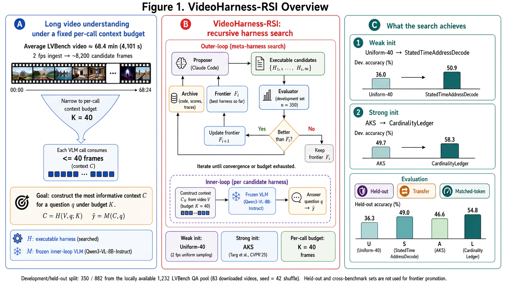
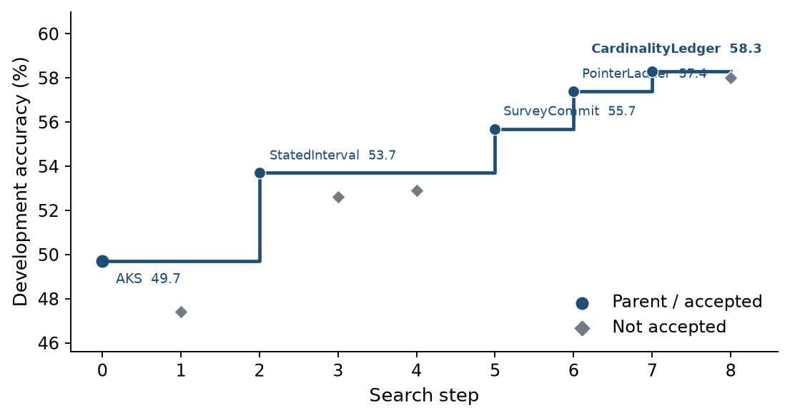

# VL-Harness-RSI

**Search the executable context-construction program around a *frozen* long-video VLM.**

The vision-language model never changes. A coding-agent proposer rewrites the
Python harness around it — what to ingest, how to retrieve, which frames to show,
how to prompt — and keeps only variants that raise accuracy. This turns
long-video understanding into a controlled study of **executable context
construction as its own optimization layer**.

```text
Frozen VLM  +  evolvable VideoMemoryHarness  →  accuracy (optional cost Pareto)
```



---

## TL;DR — one search, frozen 8B, +8.2 held-out

Same frozen **Qwen3-VL-8B-Instruct**, same K=40 answer budget, same split.
Search from the hand-crafted **AKS** parent selects **CardinalityLedger**:

| Harness | Dev 350 | Held-out 882 |
|---|---:|---:|
| Uniform-40 (floor) | 36.3 | 36.3 (320/882) |
| CLIP-kNN | 38.6 | 41.7 (368/882) |
| **AKS** (search parent) | 49.7 (174) | **46.6 (411/882)** |
| WeakFT (uniform-seeded endpoint) | 50.9 (178) | 49.0 (432/882) |
| **CardinalityLedger** (searched) | **58.3 (204)** | **54.8 (483/882)** |

**AKS → CardinalityLedger: +8.2 held-out**, paired McNemar **63 / 135**,
exact two-sided *p* = 3.39×10⁻⁷ ([`paper/mcnemar.json`](paper/mcnemar.json)).
The gain persists after the harness is frozen — it is a reusable context-construction
policy, not development-set fitting.

**Transfer** (programs frozen, official test sets, no further search):

| Benchmark | n | Uniform | AKS | CardinalityLedger |
|---|---:|---:|---:|---:|
| Video-MME | 2700 | 59.9 | 66.9 (1805) | **67.5 (1823)** |
| MLVU | 2174 | 63.2 | 72.0 (1566) | **75.0 (1631)** |

Exact counts: [`paper/scores.json`](paper/scores.json). Default protocol:
**K=40**, LVBench **val 350 / held-out 882**, seed **42**, temperature **0**
([`configs/config_k40.yaml`](configs/config_k40.yaml)).



*Accepted updates (StatedInterval → SurveyCommit → PointerLadder → CardinalityLedger)
move the dev-350 frontier; gray points are evaluated programs that did not replace it.
See also [`figures/fig_search_pareto.png`](figures/fig_search_pareto.png) for the
accuracy-vs-visual-token view.*

---

## The idea

The VLM parameters stay frozen. Search only rewrites the read-path around the
video — ingest, retrieval, keyframe selection, packing, prompting. Each candidate
is one Python class:

```python
class MyHarness(VideoMemoryHarness):
    def build_memory(self, video):            # ingest once per video
        ...
    def answer_question(self, memory, question, options):   # answer many
        ...
```

The outer loop discovers the file, evaluates it end-to-end, records accuracy and
visual-token cost, and proposes the next generation. The proposer never sees the
held-out set; promotion is a strict dev-accuracy increase.

- **WeakFT** = `stated_time_address_decode_iter9`, the uniform-seeded endpoint (search iter 9).
- **CardinalityLedger** = `cardinality_ledger`, the AKS-seeded endpoint (search iter 7).

## Quick start (no GPU)

```bash
git clone https://github.com/X-G-Y/vl-harness-rsi.git
cd vl-harness-rsi
python -m venv .venv && source .venv/bin/activate
pip install -e .                 # or: uv sync

bash scripts/run_smoke.sh        # offline pipeline on mock_niah with StubVLM
```

## Reproduce the numbers

Full commands in [`REPRODUCE.md`](REPRODUCE.md). You need:

1. The 83 LVBench videos in [`manifests/lvbench_videos.json`](manifests/lvbench_videos.json) (download yourself).
2. Frozen VLM at `http://127.0.0.1:8080/v1`.
3. CLIP `clip-ViT-B-32` at `http://127.0.0.1:8181` (for `aks`, `cardinality_ledger`, AKS-90).

You do **not** need the proposer to re-score a frozen harness (proposer sampling
is not bit-reproducible). Held-out is the **882-only** dump or `results[350:]` of a
1232-pool run — never the file-level accuracy of a 1232 JSON.

## How memory is built (ingest) vs answer budget

`build_memory` runs **once per video** and is deliberately simple and
**question-independent**: it decodes a 2 fps stream and keeps a fixed
**320-frame uniform pool** (`MAX_INGEST_FRAMES = 320`) — the same raw evidence for
every question and every searched candidate. Search does **not** rewrite this
write-time pool. Although ingest is a searchable axis, every *accepted* program left
the 320-frame pool fixed and mutated only the read/pack path — retrieval, keyframe
selection, answer-time local re-decode (still within K), ordering, and prompting.
Proposals that instead spent the search on denser ingest were rejected
(temporal-zoom re-decode −2.3, successor-window −0.6). **All reported gains are
obtained with the raw ingested evidence held fixed** — they come from *selecting and
organizing* that pool better, not from ingesting more.

Two knobs, deliberately separated in [`vl_harness/harness.py`](vl_harness/harness.py):

- **Write-time ingest pool** (`MAX_INGEST_FRAMES`, default **320 @ 2 fps**): the
  candidate frames `build_memory` indexes. Not limited by K.
- **Read-time answer budget** (`frame_budget()` / **K=40**): the per-request ceiling
  on frames shown to the VLM.

The reported numbers correspond to the **320-frame pool + K=40 pack**. This is a
controlled budget, not a global hard limit. **The shipped harness constants (pool
step, burst spacing, ladder brackets) are derived from the 320-frame pool; running
them on a much larger ingest (true 2 fps, no cap) degrades transfer.** That is a
finding of the paper (capacity ≠ selection quality), not a reproduction failure. For
higher-capacity experiments, opt in explicitly via a `config_ft_*`-style config;
don't change the default.

## What's in this repo

Runnable code:

- `VideoMemoryHarness` ingest-once / answer-many interface (`vl_harness/harness.py`)
- Floor `vl_harness/agents/pilot_uniform_k.py`, retrieval baselines, and literature-style harnesses
- AKS `vl_harness/agents/aks.py` (AKS-90 = same file, `--frame-budget 90`)
- Endpoints `vl_harness/agents/stated_time_address_decode_iter9.py`, `vl_harness/agents/cardinality_ledger.py`
- Search loop `vl_harness/meta_harness.py`, `vl_harness/inner_loop.py`, `vl_harness/stats.py`
- Data downloaders `scripts/download_*.py`, VLM gateway `scripts/serve_qwenvl.py`
- Frozen aggregates `paper/scores.json`, `paper/mcnemar.json`, `paper/bootstrap.json`

Offline checks (need the supplement unpacked as `--archive`):

```bash
python3 scripts/verify_main_scores.py --archive /path/to/videoharness-rsi-supplement
python3 scripts/verify_mcnemar.py     --archive /path/to/videoharness-rsi-supplement
```

Not in this git tree (on purpose): per-question dumps, `val_contexts.jsonl`, the full
10-step trajectory sources beyond the endpoints above, and any videos / weights / keys.

### Evolution loop

```bash
source setenv.sh
python -m vl_harness.meta_harness --config config_k40.yaml
```

Requires a coding-agent CLI or LiteLLM proposer. The outer loop is derived from
[Meta-Harness](https://github.com/stanford-iris-lab/meta-harness) (MIT; see [`NOTICE`](NOTICE)).

### Layout

```text
vl-harness-rsi/
├── README.md / DATASETS.md / REPRODUCE.md / NOTICE / LICENSE.txt
├── pyproject.toml / uv.lock / setenv.example.sh
├── configs/            # config_k40.yaml (paper protocol) + config.yaml
├── scripts/            # download_*.py, serve_qwenvl.py, run_smoke.sh, verify_*.py
├── skills/             # proposer skill injected into the coding agent
├── manifests/          # 83 video IDs + 1232-QA split (CC-BY-NC-SA-4.0)
├── paper/              # frozen scores, McNemar, bootstrap, search tables
├── figures/            # overview + search-frontier plots
├── runs/               # logs / results / experience written here (gitignored)
└── vl_harness/         # Python package: harness, meta_harness, inner_loop, agents/, ...
```

## Dataset, supplement, license

**This is a 1,232-QA subset** of LVBench (83 locally available videos), **not** the
full release. Videos are not redistributed. `AKS` here is a matched-K CLIP-B/32
selector on a 320-frame @ 2 fps pool — **not** a reproduction of the AKS paper's
BLIP-ITM / 1 fps tables (see the header of `vl_harness/agents/aks.py`).

The **supplement** (`videoharness-rsi-supplement`, DOI *TODO*) holds per-question
dumps, packed-context logs (`val_contexts.jsonl`), and table-only search trajectories.
It is a separate download (~25 MB), not committed here. After unpacking, start at
`dumps/CONTEXTS.md`. `pack_index.jsonl` is a truncated index and cannot reconstruct
full prompts.

License:

- Code (original): **Apache-2.0**
- Meta-Harness-derived loop files: **MIT** (copyright in [`NOTICE`](NOTICE))
- `manifests/` (LVBench-derived): **CC-BY-NC-SA-4.0**, not Apache-2.0
- Benchmarks and weights: not shipped; terms in [`DATASETS.md`](DATASETS.md)

Commercial use of the code does **not** grant commercial use of LVBench, Video-MME,
or MLVU. Distinct from Homer's "LV-Harness" (prompt-level skills, not code-level RSI).
